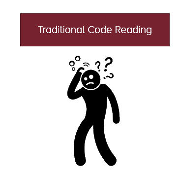

# Insight Loop Workshop
## Code by Refactoring

## Workshop Materials

Are you ready to facilitate your team as they learn the Insight Loop?

  * PDF of presentation that [describes business reason and how to facilitate the Insight Loop for developers](/dl/train-the-trainer-rbr-insight-loop.pdf) (as presented at Agile2019)
  * [Non-Coder's Facilitator's Guide for the Insight Loop Workshop](/dl/facilitator-guide.pdf) (all videos below are also embedded in guide)
    * Support [Video #1: Honest Names](/dl/Video1-HonestNames.mp4)
    * Support [Video #2: Committing - Safe](/dl/Video2-Committing-Safe.mp4)
    * Support [Video #3: Committing - Better](/dl/Video3-Committing-Better.mp4)
    * Support [Video #4: Committing - No Worse](/dl/Video4-Committing-NoWorse.mp4)
    * Support [Video #5: Just Enough Process](/dl/Video5-Committing-JustEnoughProcess.mp4)
    * Support [Video #6: Deep Safety](/dl/Video6-Committing-DeepSafety.mp4)
    * Support [Video #7: The Insight Loop](/dl/Video7-TheInsightLoop.mp4)

## Why Developers Care

The Insight Loop reduces time for each story, reduces bugs, reduces cost of future stories, and makes it less frustrating for them! 

Up to this point, developers have read code in a traditional manner. They read a piece, understand it, and try to remember it as they get the next insight. That is unfriendly to the brain as they try to remember so very much.

You will be introducing the Insight Loop, which is a new way of reading that works well with the brain. This makes reading code faster, easier, and---more importantly---less error-prone.

## What's Next?

2 things!

  1. Making these habits stick.
  2. A whole bunch more of Code by Refactoring, to address common legacy code problems.

Curious? Please reach out to Deep Roots by [email (sales@digdeeproots.com)](mailto:sales@digdeeproots.com) or on [Twitter (@digdeeproots)](https://twitter.com/digdeeproots)!

## Delivery Agreement

You are free to perform the workshop, as long as:

1. You don't charge for the workshop.
2. All the recipients are in the same organization (no public workshops).
3. You perform the workshop relatively intact, and not as a part of some other workshop.

Please contact us at [legal@digdeeproots.com](mailto:legal@digdeeproots.com) if you would like to edit the workshop or include it in a larger workshop. We are happy to work with requests.

 Code by Refactoring Insight Loop Workshop by <a xmlns:cc="http://creativecommons.org/ns#" href="https://insightloop.digdeeproots.com/" property="cc:attributionName" rel="cc:attributionURL">Deep Roots</a> is licensed under a <a rel="license" href="http://creativecommons.org/licenses/by-nc-nd/4.0/">Creative Commons Attribution-NonCommercial-NoDerivatives 4.0 International License</a>. Permissions beyond the scope of this license, such as usage within companies, are available at <a xmlns:cc="http://creativecommons.org/ns#" href="https://insightloop.digdeeproots.com/license" rel="cc:morePermissions">https://insightloop.digdeeproots.com/license</a>.

@copy; 2019, Dig Deep Roots, LLC.